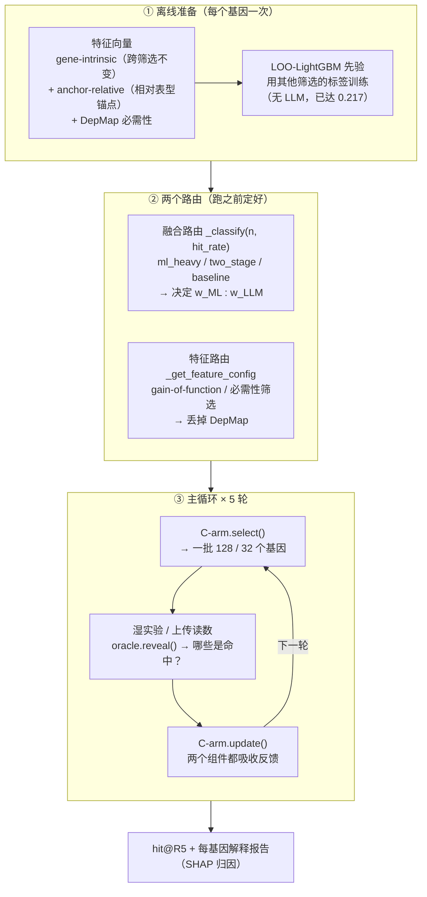
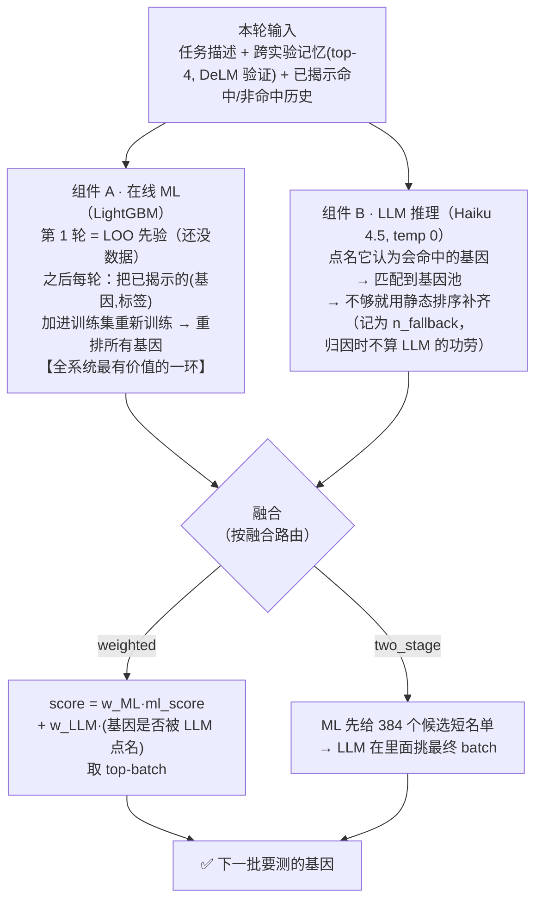
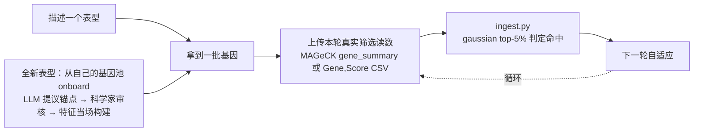

# Waddington 基因选择算法 — 全流程

> **问题**:顺序式 CRISPR 筛选设计。一个筛选有 ~18,000 个基因,只有 ~2–10% 是"命中"。每轮只能测一批(128 个,小筛选 32 个),测完才知道哪些命中,据此挑下一批。
> **目标**:5 轮内最大化命中率 `hit@R5`(= 累计命中 / 总命中)。
> **核心系统 = C-arm,当前 hit@R5 = 0.256**(纯 ML 先验 0.217,加随机 0.066)。

---

## 一、全景

---

## 二、一轮内部：`select()` 怎么做决策

两个组件**并行**产生意见,再**融合**成一批基因。

**为什么 LLM 只做重加权、不自由选**:反事实归因(~4200 个基因)显示——ML 和 LLM **都认可**的基因命中率 ~21%,而 **LLM 单方面**选的只有 ~10%(低于 ML 自己的 ~15%)。**LLM 是验证者,不是提议者。** 给它工具让它自主 → 更差(0.209);外化知识(记忆/技能库/富集)→ ≈0。

---

## 三、两个路由的具体规则

**融合路由**(决定谁说了算):

| 路由 | 条件 | w_ML : w_LLM | 谁定最终 batch |
|---|---|---|---|
| `ml_heavy` | n>15000 且 2%<hr<7%（大而稀） | **0.8 : 0.2** | 加权，ML 主导 |
| `two_stage` | 3000<n≤15000 且 hr>8% | — | ML 出短名单，LLM 定 |
| `baseline` | 其余 | 0.6 : 0.4 | 加权 |

**特征路由**(决定用不用敲除派生的 DepMap):

| 数据集 | 用的特征表 | 理由 |
|---|---|---|
| Steinhart（CRISPRa 过表达）| v1，**无 DepMap** | 敲除先验对过表达筛选误导 |
| K562-Essential（策展必需性）| v1，**无 DepMap** | 泛癌必需性≈把标签重说一遍 |
| 其余 | v3，含 pan-cancer / K562 DepMap | 敲除先验有用 |

> 这个特征路由是**凭经验试出来**的,后来才发现它对应一个真实机制:SHAP 显示,凡有 DepMap 的筛选,`depmap_frac_ess` 都是第一大特征;而 Steinhart / K562-Essential 上模型**一个 DepMap 特征都不用**。

---

## 四、特征是怎么构建的

- **gene-intrinsic**(基因内在,跨筛选 100% 不变):PPI 连接度、STRING degree、pLI 约束、通路数量……
- **anchor-relative**(相对表型的锚点基因):`g1_ppi_score`(到该表型核心基因的 PPI 距离)、`archs4_coexpr`(共表达)、`kegg_overlap`(通路重叠)。**这些编码"这个基因离该表型的已知生物学有多近"**,是**扰动无关**的(激活 vs 敲低同一表型,锚点相同)。
- **DepMap 必需性**(全来自敲除筛选)。

**LOO 训练**:预测某个筛选时,用**其他所有筛选**的命中标签训练 LightGBM(留一法)。STRING/ARCHS4 缓存是**逐锚点**的(315 个 JSON),所以 onboard 一个新表型只花 ~10 次 API 调用,不是 18k。

---

## 五、科学家实际怎么用(对话入口)

流水线外面包了一层**对话前端**(`frontend/`,Node,tool-less pi-ai,CLI + Web):

**关键设计**:对话壳里的 LLM 是**刻意 tool-less** 的——它只对话、只讲解,**从不亲自选基因**。基因由确定性的 Python 流水线(C-arm)选。每次运行产出一份**解释报告**(为什么选每个基因)。

**一个可选模式** `--reason-from-structure`:让 LLM 对**匿名的结构特征**做推理,而不是靠基因名回忆——平均性能不掉(结构价值 +0.053,9 个筛选全为正),换来"不依赖记忆、可泛化到训练外基因、可审计"。**默认关**,按需开(在 gain-of-function 筛选上会更差,是个稳健性权衡)。

---

## 一句话概括

> **一个每轮自我重训的在线 GBM 做主力,一个 LLM 在它的候选上做生物学验证性重加权,靠两个路由决定权重和特征集,整个包在一个只讲解、不决策的对话壳里。**

---

### 关键文件对照

| 阶段 | 文件 |
|---|---|
| 核心 C-arm（路由 + 融合） | `waddington_select/arms/waddington_c_arm.py` |
| 在线 ML（每轮重训） | `waddington_select/arms/online_adaptive_arm.py` |
| LLM 推理（任务/记忆/补齐） | `waddington_select/arms/llm_reasoning_arm.py` |
| 结构推理模式（A1，opt-in） | `waddington_select/arms/waddington_c_feature_reasoning_arm.py` |
| 主循环（select→reveal→update） | `waddington_select/sequential_runner.py` |
| 真值 / 数据集 | `waddington_select/oracle.py` |
| 上传读数 → 命中判定 | `waddington_select/ingest.py` |
| 特征构建 / LOO 训练表 | `waddington_select/features.py` |
| 结果、消融、图表说明 | `docs/results_tables.tex`(→ `.pdf`) |
